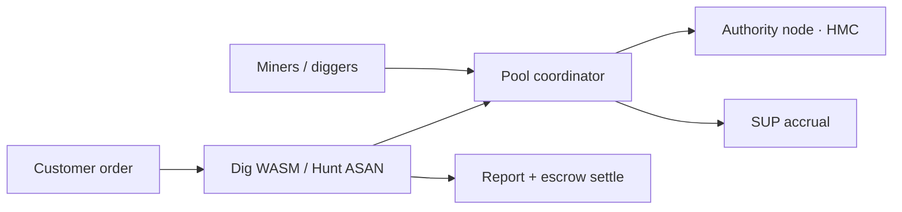

<div align="center">

<pre aria-label="HackMe Network ASCII logo">
██╗  ██╗ █████╗  █████╗ ██╗  ██╗███╗   ███╗███████╗    ███╗   ██╗███████╗████████╗██╗    ██╗ ██████╗ ██████╗ ██╗  ██╗
██║  ██║██╔══██╗██╔════╝██║ ██╔╝████╗ ████║██╔════╝    ████╗  ██║██╔════╝╚══██╔══╝██║    ██║██╔═══██╗██╔══██╗██║ ██╔╝
███████║███████║██║     █████╔╝ ██╔████╔██║█████╗      ██╔██╗ ██║█████╗     ██║   ██║ █╗ ██║██║   ██║██████╔╝█████╔╝
██╔══██║██╔══██║██║     ██╔═██╗ ██║╚██╔╝██║██╔══╝      ██║╚██╗██║██╔══╝     ██║   ██║███╗██║██║   ██║██╔══██╗██╔═██╗
██║  ██║██║  ██║╚██████╗██║  ██╗██║ ╚═╝ ██║███████╗    ██║ ╚████║███████╗   ██║   ╚███╔███╔╝╚██████╔╝██║  ██║██║  ██╗
╚═╝  ╚═╝╚═╝  ╚═╝ ╚═════╝╚═╝  ╚═╝╚═╝     ╚═╝╚══════╝    ╚═╝  ╚═══╝╚══════╝   ╚═╝    ╚══╝╚══╝  ╚═════╝ ╚═╝  ╚═╝╚═╝  ╚═╝
</pre>

# HackMe Network

### Useful Proof-of-Work · public GPU pool · Dig / Hunt · paper Exchange

Hashrate settles on-chain. Security work is escrowed, distributed, and reported — not a slide deck.

<br/>

[](https://hackme.tech/downloads.html)
[](https://hackme.tech/pool/coordinator/api/pool/stats)
[](https://github.com/jokeez/hackme/actions/workflows/ci.yml)
[](LICENSE)
[](https://www.youtube.com/@HackmeTech)

<br/>

<a href="https://www.youtube.com/watch?v=KdRr6zK2QVE">
  
</a>

<br/>

**▶ [Watch the walkthrough](https://www.youtube.com/watch?v=KdRr6zK2QVE)** · install · mine · pool · what HackMe is

<br/>

| | | | |
|:--:|:--:|:--:|:--:|
| **[⬇ Downloads](https://hackme.tech/downloads.html)** | **[⚡ Quick start](docs/QUICK_START.md)** | **[⛏ Mine](docs/SETUP.md)** | **[🔬 Dig · Hunt](https://hackme.tech/developers.html)** |
| **[📈 Exchange](https://exchange.hackme.tech/)** | **[🧪 Research](https://hackme.tech/research.html)** | **[📖 Docs](docs/INDEX.md)** | **[🌐 hackme.tech](https://hackme.tech)** |

</div>

---

## What it is

| Lane | You get |
|------|---------|
| **Mine** | Public HTTP pool · CUDA / OpenCL / CPU · hybrid Ed25519 submits · **HMC** rewards · **SUP** loyalty |
| **Dig** | Customer WASM packs (Scan / Audit / Deep) · **20/80** escrow · pool workers · deliverable report |
| **Hunt** | ASAN/UBSan catalog & customer repos · Lite / Standard / Heavy · **50/50** escrow · coordinator replay |
| **Exchange** | **Paper** trading desk at [exchange.hackme.tech](https://exchange.hackme.tech/) — no custody, no live matching |
| **Research** | Public ledgers (Hunt Watch, OSS CVE Watch, Bitcoin30) — evidence, not hype |



Payout follows **accepted work**, not lottery blocks. Model: [NETWORK_MODEL.md](docs/NETWORK_MODEL.md).

---

## Status · 0.1.0-rc17 LIVE

| Area | State |
|------|--------|
| **Installers** | Win · Linux · `.deb` · Dig/Hunt CLI · HackMe OS ISO + **SHA256SUMS** |
| **Pool** | Live public coordinator · auto `target_mod` · hybrid signer |
| **Dig / Hunt** | Live product rails · verify SHA before upgrade |
| **Paper Exchange** | Desk live · **not** a CEX, **not** financial advice |
| **Hunt Watch 2026sep** | **12/12 closed** · [ledger](https://hackme.tech/reports/hunt-watch-2026sep/) |
| **OSS CVE Watch** | nghttp2 **14/14** · libheif **14/14** CLEAN ledgers |
| **HMS storage** | Preview only — not a miner lane |

Channel notes: [docs/HACKME_RC17.md](docs/HACKME_RC17.md) · release: [GitHub 0.1.0-rc17](https://github.com/jokeez/hackme/releases/tag/0.1.0-rc17)

**Honesty:** Hunt/Dig **CLEAN ≠ CVE claim**. Customer value is **bugs in their target + report + escrow**, not “we mint CVEs.” libFuzzer often wins raw exec/s; Hunt wins fleet + deliverable — [HUNT_VS_LIBFUZZER.md](docs/HUNT_VS_LIBFUZZER.md).

---

## Quick start

<table>
<tr>
<td width="33%" valign="top">

### Linux

```bash
# Recommended: release tarball
# https://hackme.tech/downloads.html  → verify SHA256

# Or from source
git clone https://github.com/jokeez/hackme.git
cd hackme
cp .env.desktop.example .env.desktop
bash scripts/ops/desktop_mode_up.sh
```

Dashboard → **http://127.0.0.1:8080** · [SETUP.md](docs/SETUP.md)

</td>
<td width="33%" valign="top">

### Windows

1. [Download installer](https://hackme.tech/downloads.html)
2. Verify **SHA256**
3. Start **HackMe Miner**

[Windows guide →](docs/MINER_WINDOWS_ONE_CLICK.md)

</td>
<td width="33%" valign="top">

### HackMe OS

Flash the **rc17** ISO → boot → wallet + mining.

```bash
bash scripts/tests/verify_hackme_iso.sh your.iso
```

[OS guide →](docs/HACKME_OS.md)

</td>
</tr>
</table>

Pool join: set `HACKME_PUBLIC_AUTHORITY_BASE=https://hackme.tech` (see [OPEN_POOL_MINERS.md](docs/OPEN_POOL_MINERS.md)).  
GPU backends: [GPU_MINING_BACKENDS.md](docs/GPU_MINING_BACKENDS.md).

---

## Dig & Hunt (customers)

| Product | Escrow | What you buy |
|---------|--------|----------------|
| **Dig · Scan / Audit / Deep** | 20/80 | WASM campaign on *your* binary/guards · pool-distributed Dig |
| **Hunt · Lite / Standard / Heavy** | 50/50 | ASAN depth tiers · shards on the fleet · coordinator replay |

```bash
hackme-fuzzing wizard --pack filter_utf8 --package audit
hackme-fuzzing hunt … --package hunt_lite   # see docs
```

| Dig package | ~HMC | Runs (guide) |
|-------------|------|----------------|
| Scan | 1 | 64 |
| Audit | 5 | 256 |
| Deep | 25 | 2048 (hub Deep often capped) |

| Hunt package | ~HMC | Target shards × exec/shard |
|--------------|------|----------------------------|
| Lite | 20 | ~1200 × 32 |
| Standard | 60 | ~4000 × 128 |
| Heavy | 150+ | ~12000 × 256 |

- Landing: [developers.html](https://hackme.tech/developers.html) · [fuzz-guide.html](https://hackme.tech/fuzz-guide.html)
- [FUZZ_PRODUCT_GUIDE.md](docs/FUZZ_PRODUCT_GUIDE.md) · [HUNT_ECONOMICS.md](docs/HUNT_ECONOMICS.md) · [CUSTOMER_FUZZ_DELIVERABLES.md](docs/CUSTOMER_FUZZ_DELIVERABLES.md)

Bootstrap smoke orders (tens of shards) prove the rail — they are **not** a paid Lite/Standard depth buy.

---

## Research

| Series | Hub |
|--------|-----|
| **Hunt Watch 2026sep** | [hunt-watch-2026sep/](https://hackme.tech/reports/hunt-watch-2026sep/) |
| **Bitcoin30** | [bitcoin30.html](https://hackme.tech/reports/bitcoin30.html) |
| **OSS CVE · nghttp2** | [oss-cve-watch/](https://hackme.tech/reports/oss-cve-watch/) |
| **OSS CVE · libheif** | [oss-cve-watch-libheif/](https://hackme.tech/reports/oss-cve-watch-libheif/) |
| **Index** | [research.html](https://hackme.tech/research.html) |

---

## Ecosystem

| Asset | Role | Status |
|-------|------|--------|
| **HMC** | PoW + pool settlement | Live |
| **SUP** | Support accrual while mining | Live |
| **Paper Exchange** | Practice desk | Live (paper only) |
| **HMS** | Storage / seal epochs | Preview |

---

## Build & verify

```bash
go build -trimpath -o hackme-node .
go build -trimpath -tags opencl -o workerpoh-opencl ./cmd/workerpoh
go test ./...
bash scripts/tests/public_site_smoke.sh
bash scripts/tests/version_consistency_gate.sh
```

Release: `VERSION=0.1.0-rc17 bash scripts/release/make_release_bundle.sh` — [scripts/release/README.md](scripts/release/README.md)

---

## Config & trust

| | |
|--|--|
| Local desktop | `.env.desktop` (from `.env.desktop.example`) |
| Secrets | `.secrets/*` — **never commit** · [SECURITY_REPO.md](docs/SECURITY_REPO.md) |
| Official site | **https://hackme.tech** only |
| Downloads | Always verify **SHA256** on [downloads.html](https://hackme.tech/downloads.html) |
| Disclosure / bounty | [contacts.html](https://hackme.tech/contacts.html) · [BUG_BOUNTY.md](docs/BUG_BOUNTY.md) |
| Threat model | [docs/SECURITY.md](docs/SECURITY.md) |

Docs map: [docs/INDEX.md](docs/INDEX.md) · API: [docs/API.md](docs/API.md) · Architecture: [docs/ARCHITECTURE.md](docs/ARCHITECTURE.md)

---

## Contributing

[CONTRIBUTING.md](CONTRIBUTING.md) · AGPL-3.0 · [TRADEMARK.md](TRADEMARK.md) · no secrets in git.

---

<div align="center">

**HackMe Network** — useful work, open code, honest scope.

<br/>

[](https://www.youtube.com/watch?v=KdRr6zK2QVE)
[](https://t.me/hackme_tech)
[](https://hackme.tech)
[](https://bitcointalk.org/index.php?topic=5583373.0)
[](https://github.com/jokeez/hackme)

<br/>

<sub>Copyright © 2026 HackMe contributors · <a href="LICENSE">AGPL-3.0</a> · Not financial advice</sub>

</div>
